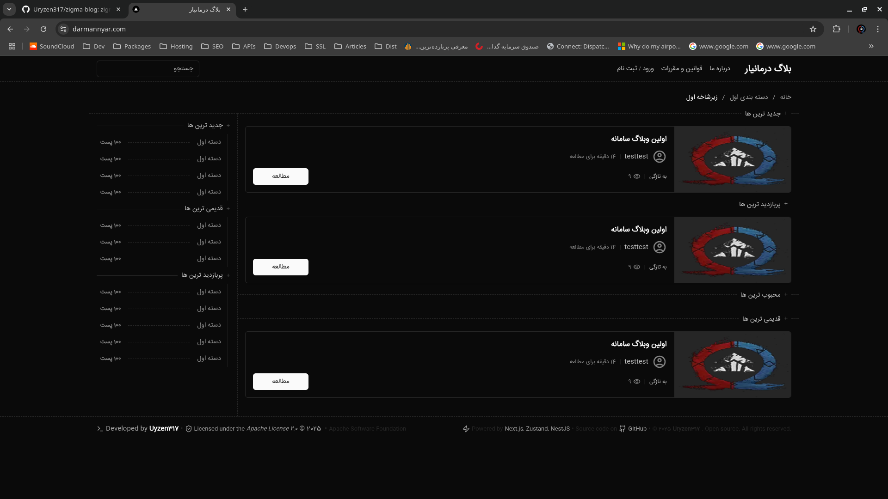

# 📝 Zigma Blog (a.k.a. Darmannyar)

A full-stack, open source blogging platform built with **Next.js**, **Zustand**, and **NestJS**.

📍 **Live site**: [darmannyar.com](https://darmannyar.com)  
📦 **Repository**: [github.com/Uryzen317/zigma-blog](https://github.com/Uryzen317/zigma-blog)

> 📝 The project was originally developed under the name **Zigma Blog**, but launched under the final name [**Darmannyar**](https://darmannyar.com) during the final stages.

---

## 📁 Repository Structure

This monorepo is split into two main branches:

- **[`client`](https://github.com/Uryzen317/zigma-blog/tree/client)** — Frontend source code (Next.js)
- **[`server`](https://github.com/Uryzen317/zigma-blog/tree/server)** — Backend source code (NestJS)

---

## 🚀 Getting Started

### 🖥️ Client (Frontend)

To run the frontend locally:

```bash
npm run start:dev
```

> ⚠️ **Note for production (CI/CD):**  
> Make sure to **rename `public-env.prod.ts` to `public-env.ts`** during the build pipeline.

---

### 🧠 Server (Backend)

To run the backend locally:

1. **Copy the `.env.example` file** to a new `.env` file:

   ```bash
   cp .env.example .env

   ```

2. **Update the `.env` file** with the appropriate environment variables for your local setup.

3. Then, run the server:

```bash
npm run start:dev
```

> ⚠️ **Note for production (CI/CD):**  
> Ensure that the `.env` file is properly set up on your production environment with the necessary credentials and variables.

---

## 📸 Screenshots

### 🏠 Homepage



### 📝 Post View


### 📝 Login Page


---

## 📄 License

This project is licensed under the **Apache License 2.0**.  
See [LICENSE](./LICENSE) for full license text.

---

## 🤝 Contributing

Pull requests are welcome!  
For major changes, please open an issue first to discuss what you'd like to propose.

---

## 🌐 Author

Developed by [Uyzen317](https://uryzen317.ir)

---
